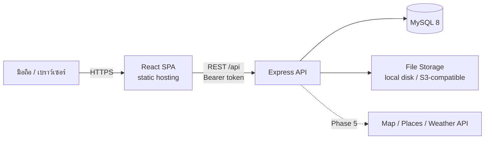
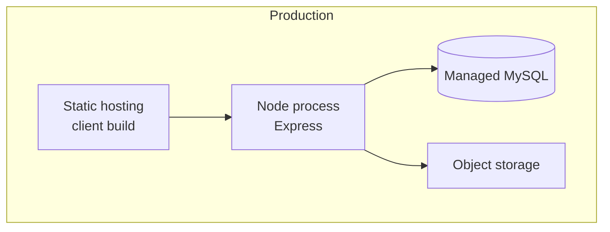

# Architecture

## 1. ภาพรวมระบบ



- **SPA + REST API แยกกัน** deploy แยกได้ ฝั่ง API ไม่ผูกกับ UI
- **Monolith แบบแบ่ง module** ไม่ใช่ microservice ขนาดโปรเจกต์นี้ monolith ดูแลง่ายกว่ามาก
- External API ทั้งหมดเรียกผ่าน backend เพื่อซ่อน key และ cache ผลได้

## 2. Backend

### 2.1 Layer

```
HTTP Request
    │
    ▼
Route            จับคู่ path กับ handler, ต่อ middleware
    │
    ▼
Middleware       authenticate → validate(schema) → requireTripRole(role)
    │
    ▼
Controller       แปลง req → เรียก service → แปลงผลเป็น res
    │
    ▼
Service          business logic, กฎของ domain, transaction
    │
    ▼
Repository       query ทั้งหมด (Prisma / $queryRaw)
    │
    ▼
MySQL
```

| Layer      | ทำได้                                                  | ห้ามทำ                       |
| ---------- | ------------------------------------------------------ | ---------------------------- |
| Controller | อ่าน `req.params/body/user`, เรียก service, `res.json` | business logic, เรียก Prisma |
| Service    | ตรวจกฎ, คำนวณ, เรียกหลาย repository, throw `AppError`  | แตะ `req`/`res`, เขียน query |
| Repository | เรียก Prisma, แปลงผลลัพธ์จาก DB                        | ตัดสินใจเชิงธุรกิจ           |

Repository ถูกเก็บให้บาง เป็นฟังก์ชันธรรมดาต่อ domain ไม่มี base class หรือ generic repository
เหตุผลที่ยังคงไว้ทั้งที่ Prisma เองก็เป็น data layer อยู่แล้ว คือให้ query อยู่ที่เดียว ทดสอบ service ได้โดย mock repository
และบังคับได้ง่ายว่าทุก query มี `trip_id`

### 2.2 จัดโฟลเดอร์ตาม feature

แต่ละ domain มีไฟล์ครบทุก layer อยู่ในโฟลเดอร์เดียวกัน เปิดโฟลเดอร์เดียวเห็นทั้ง feature

```
server/
├── prisma/
│   ├── schema.prisma
│   ├── migrations/
│   └── seed.js
├── src/
│   ├── app.js                    สร้างและ export express app (Vercel ใช้ไฟล์นี้)
│   ├── main.js                   เรียก listen สำหรับ dev และ VPS
│   ├── config/
│   │   └── env.js                อ่านและ validate env ด้วย Zod ตอน boot
│   ├── lib/
│   │   ├── prisma.js             Prisma client ตัวเดียวทั้งแอป
│   │   ├── AppError.js
│   │   ├── jwt.js
│   │   └── storage/              interface เดียว สอง implementation
│   │       ├── index.js
│   │       ├── local.storage.js
│   │       └── s3.storage.js
│   ├── middlewares/
│   │   ├── authenticate.js
│   │   ├── requireTripRole.js
│   │   ├── validate.js
│   │   ├── rateLimit.js
│   │   ├── upload.js
│   │   ├── notFound.js
│   │   └── errorHandler.js
│   ├── modules/
│   │   ├── health/               ตัวอย่างอ้างอิงของรูปแบบ module
│   │   ├── auth/
│   │   │   ├── auth.routes.js
│   │   │   ├── auth.controller.js
│   │   │   ├── auth.service.js
│   │   │   ├── auth.repository.js
│   │   │   └── auth.schema.js
│   │   ├── users/
│   │   ├── trips/
│   │   ├── members/
│   │   ├── places/
│   │   ├── itinerary/
│   │   ├── expenses/
│   │   ├── journal/
│   │   ├── photos/
│   │   ├── timeline/             read model ไม่มีตารางของตัวเอง
│   │   └── summary/              read model ไม่มีตารางของตัวเอง
│   ├── routes/
│   │   └── index.js              รวม router ทุก module ใต้ /api
│   └── utils/
│       ├── money.js
│       └── datetime.js
├── tests/
├── uploads/                      dev เท่านั้น อยู่ใน .gitignore
├── .env.example
└── package.json
```

### 2.3 Authentication

| Token              | อายุ    | เก็บที่ไหน                              | ใช้ทำอะไร                                   |
| ------------------ | ------- | --------------------------------------- | ------------------------------------------- |
| Access token (JWT) | 15 นาที | memory ของ SPA                          | แนบ `Authorization: Bearer` ทุก request     |
| Refresh token      | 30 วัน  | cookie `httpOnly; Secure; SameSite=Lax` | ขอ access token ใหม่ที่ `/api/auth/refresh` |

- Refresh token เป็นค่าสุ่ม เก็บใน DB เฉพาะค่า **hash** และ **หมุนใหม่ทุกครั้งที่ใช้** (rotation)
- ถ้ามีการใช้ token ที่ถูกหมุนไปแล้วซ้ำ ให้เพิกถอนทุก token ของผู้ใช้นั้น
- ไม่เก็บ token ใน `localStorage` เพื่อลดความเสียหายถ้าโดน XSS
- Axios interceptor: เจอ 401 → เรียก refresh ครั้งเดียว → ยิง request เดิมซ้ำ
- รหัสผ่าน hash ด้วย bcrypt cost 12
- อายุ 30 วันเลือกเพราะไม่อยากให้ผู้ใช้โดนเด้งออกกลางทริป

Frontend กับ API ควรอยู่ใต้โดเมนหลักเดียวกัน (เช่น `app.example.com` กับ `api.example.com`)
เพื่อให้ cookie แบบ `SameSite=Lax` ทำงานได้และลดความเสี่ยง CSRF

### 2.4 Authorization

สิทธิ์ทั้งหมดมาจากตาราง `trip_members` ที่เดียว

| Role     | อ่าน | เพิ่ม/แก้ข้อมูลในทริป | แก้ตัวทริป, จัดการสมาชิก, ลบทริป |
| -------- | ---- | --------------------- | -------------------------------- |
| `owner`  | ✅   | ✅                    | ✅                               |
| `editor` | ✅   | ✅                    | ❌                               |
| `viewer` | ✅   | ❌                    | ❌                               |

`requireTripRole('editor')` ทำงานดังนี้

1. อ่าน `:tripId` จาก path
2. หา membership ของ `req.user.id` ในทริปนั้น
3. ไม่เจอ → ตอบ **404** (ไม่ใช่ 403 เพื่อไม่เปิดเผยว่าทริปนั้นมีอยู่)
4. เจอแต่ role ไม่พอ → 403
5. ผ่าน → แนบ `req.trip` และ `req.member` ให้ controller ใช้

ทุก endpoint ของข้อมูลในทริปซ้อนอยู่ใต้ `/api/trips/:tripId/` รวมถึงตอนแก้/ลบรายการเดี่ยว
เพื่อให้ middleware ตัวเดียวคุมได้ทั้งหมด และ repository รับ `tripId` เป็นเงื่อนไขเสมอ

### 2.5 Error Handling

```js
throw new AppError('EXPENSE_NOT_FOUND', 404, 'ไม่พบรายการค่าใช้จ่าย');
```

- Service throw `AppError` → `errorHandler` middleware แปลงเป็น JSON รูปแบบเดียว (ดู API.md)
- Zod error → 422 พร้อมรายการ field ที่ผิด
- Prisma error ที่รู้จัก (เช่น unique ซ้ำ) แปลงเป็น `AppError` ใน repository
- Error ที่ไม่รู้จัก → log เต็ม, ตอบ 500 ข้อความกลาง ๆ

### 2.6 File Upload และ Storage

ลำดับการประมวลผลรูป

1. `multer` รับไฟล์ลง memory จำกัดขนาด (10 MB) และจำนวนต่อ request
2. ตรวจชนิดจาก **เนื้อไฟล์จริง** (magic bytes) รับเฉพาะ JPEG / PNG / WebP / HEIC
3. `sharp` อ่าน EXIF เก็บเวลาที่ถ่ายและพิกัด จากนั้น **ลบ EXIF ออก** หมุนภาพให้ตรง
4. สร้าง 2 ขนาด: แสดงผล (ด้านยาว ~1600px) และ thumbnail (~400px) เป็น WebP
5. ตั้งชื่อไฟล์ใหม่เป็น UUID เก็บผ่าน `storage` interface
6. บันทึก metadata ลงตาราง `photos`

`storage` มี interface เดียว: `put(key, buffer)`, `getStream(key)`, `delete(key)`, `getSignedUrl(key, ttl)`
dev ใช้ local disk, production ใช้ S3-compatible สลับด้วย env ไม่ต้องแก้โค้ดที่เรียกใช้

**รูปไม่เปิด public** แท็ก `` แนบ Bearer token ไม่ได้ API จึงคืน **signed URL อายุสั้น** มาใน response
ฝั่ง local ใช้ HMAC ลงนาม path + เวลาหมดอายุ ฝั่ง S3 ใช้ presigned URL

### 2.7 Read Model: Timeline และ Summary

ทั้งสองไม่มีตารางของตัวเอง

**Timeline** = journal entries (พร้อมรูปและ expense ที่ผูกอยู่) + expenses ที่ไม่ได้ผูกกับ entry ใด
service ดึงสองชุด รวมกัน เรียงตามเวลา แล้วจัดกลุ่มตามวันใน timezone ของทริป

**Summary** = SQL aggregate ตรง ๆ (`SUM ... GROUP BY`) ผ่าน `$queryRaw`
ไม่เก็บยอดรวมไว้ใน `trips` เพราะข้อมูลทริปหนึ่งมีไม่กี่ร้อยแถว คำนวณสดเร็วพอและไม่มีวันผิด

### 2.8 เวลาและเงิน

| ข้อมูล                                  | เก็บอย่างไร     | เหตุผล                                                       |
| --------------------------------------- | --------------- | ------------------------------------------------------------ |
| `spent_at`, `occurred_at`, `created_at` | `DATETIME` UTC  | เป็นจุดเวลาที่เกิดขึ้นจริง                                   |
| `start_date`, `end_date`, `day_date`    | `DATE` ท้องถิ่น | "วันที่ 10" คือวันที่ 10 ของที่นั่น ไม่ควรเลื่อนตาม timezone |
| `start_time`, `end_time`                | `TIME` ท้องถิ่น | เวลาตามแผน ไม่ใช่จุดเวลา                                     |
| เงิน                                    | `DECIMAL(12,2)` | ห้าม FLOAT, API ส่งเป็น string                               |

`trips.timezone` (ค่าเริ่มต้น `Asia/Bangkok`) ใช้ตอนจัดกลุ่มเหตุการณ์เป็นรายวัน

หมายเหตุ Prisma: คอลัมน์ `TIME` จะถูก map เป็น `DateTime` ที่มีวันที่ 1970-01-01
ให้ repository แปลงเป็น string `"HH:mm"` ก่อนส่งขึ้น service

### 2.9 Idempotency

`expenses` และ `journal_entries` มีคอลัมน์ `client_id` (UUID ที่ client สร้าง) unique คู่กับ `trip_id`
ถ้า POST มาซ้ำด้วย `client_id` เดิม server คืนรายการเดิมด้วย 200 ไม่สร้างใหม่
ทำให้ปุ่ม "ลองอีกครั้ง" ปลอดภัยเมื่อเน็ตหลุด และเป็นฐานของ offline queue ใน Phase 7

## 3. Frontend

### 3.1 โครงสร้าง

```
client/
├── public/
├── src/
│   ├── main.jsx
│   ├── app/
│   │   ├── App.jsx
│   │   ├── router.jsx            route ทั้งหมด + lazy loading
│   │   └── providers.jsx         QueryClientProvider, AuthProvider
│   ├── pages/                    1 ไฟล์ = 1 route, ประกอบ feature เข้าด้วยกัน
│   ├── layouts/
│   │   ├── AuthLayout.jsx
│   │   ├── AppLayout.jsx
│   │   └── TripLayout.jsx        header ทริป + bottom tab
│   ├── components/
│   │   └── ui/                   Button, Input, Sheet, Dialog, Spinner,
│   │                             EmptyState, ErrorState, Skeleton, Toast
│   ├── features/
│   │   ├── auth/
│   │   │   ├── api.js            ฟังก์ชันเรียก API
│   │   │   ├── hooks.js          useLogin, useMe ...
│   │   │   └── components/
│   │   ├── trips/
│   │   ├── members/
│   │   ├── itinerary/
│   │   ├── expenses/
│   │   ├── journal/
│   │   ├── timeline/
│   │   └── summary/
│   ├── context/
│   │   └── AuthContext.jsx
│   ├── hooks/                    hook ที่ใช้ร่วม เช่น useOnlineStatus
│   ├── lib/
│   │   ├── axios.js              instance + interceptor
│   │   └── queryClient.js
│   ├── utils/
│   │   ├── formatMoney.js
│   │   └── formatDate.js
│   └── styles/
│       └── index.css
├── .env.example
└── package.json
```

`pages / components / layouts / hooks / context / utils` ตรงตามที่กำหนดไว้
ส่วน "Services / API" ถูกวางไว้ใน `features/<domain>/api.js` เพื่อให้โค้ดของ feature เดียวกันอยู่ด้วยกัน

### 3.2 State

| ชนิด                           | เครื่องมือ                |
| ------------------------------ | ------------------------- |
| ข้อมูลจาก server               | TanStack Query            |
| สถานะ login                    | `AuthContext`             |
| state ของฟอร์มและ UI ในหน้า    | `useState` / `useReducer` |
| filter, tab ที่ควรแชร์ลิงก์ได้ | URL search params         |

เหตุผลที่เพิ่ม TanStack Query: Loading / Error state, cache, การ refetch หลังบันทึก และ optimistic update
เป็นสิ่งที่ requirement ต้องการทุกหน้า ถ้าเขียนเองด้วย `useEffect` จะซ้ำกันทุกจุด
ไม่ใช้ Redux/Zustand เพราะ client state มีน้อยมาก

### 3.3 Routing

```
/login
/register
/                                 Dashboard: รายการทริป
/trips/new
/trips/:tripId                    ภาพรวมทริป (ถ้า active จะเป็น Trip Mode)
/trips/:tripId/plan               Itinerary รายวัน
/trips/:tripId/expenses
/trips/:tripId/journal            Timeline
/trips/:tripId/summary
/trips/:tripId/settings           แก้ทริป, สมาชิก
```

### 3.4 หลัก UI

- ออกแบบที่ 375px ก่อน แล้วค่อยขยาย
- เมนูหลักเป็น bottom tab bar, ปุ่มเพิ่มอยู่มุมล่างในระยะนิ้วโป้ง
- ฟอร์มเพิ่มข้อมูลเปิดเป็น bottom sheet ไม่เปลี่ยนหน้า
- เป้าแตะขั้นต่ำ 44×44px
- ช่องตัวเลขใช้ `inputmode="decimal"` ให้ขึ้นแป้นตัวเลข
- ทุกหน้าที่ดึงข้อมูลต้องมี Skeleton, EmptyState, ErrorState พร้อมปุ่มลองใหม่
- การลบต้องมี dialog ยืนยัน

## 4. Security Baseline

| หัวข้อ        | มาตรการ                                                                             |
| ------------- | ----------------------------------------------------------------------------------- |
| Password      | bcrypt cost 12, ความยาวขั้นต่ำ 8                                                    |
| JWT           | secret จาก env, access token อายุสั้น, refresh rotation                             |
| Authorization | `requireTripRole` ทุก route ในทริป, query scope ด้วย `trip_id`                      |
| Input         | Zod ทุก endpoint, ตัด field ที่ไม่รู้จักทิ้ง                                        |
| SQL Injection | Prisma parameterize ให้, `$queryRaw` ใช้ tagged template เท่านั้น                   |
| XSS           | React escape ให้โดยปริยาย, ไม่ใช้ `dangerouslySetInnerHTML`, ตั้ง CSP ผ่าน `helmet` |
| CORS          | whitelist origin จาก env, เปิด `credentials`                                        |
| Rate limit    | เข้มที่ `/auth/*`, ทั่วไปที่ `/api/*`, แยกสำหรับ upload                             |
| Upload        | ตรวจ magic bytes, จำกัดขนาด, ตั้งชื่อใหม่, encode ใหม่ด้วย sharp                    |
| Secrets       | `.env` เท่านั้น, validate ตอน boot, มี `.env.example`                               |
| Response      | ไม่ส่ง hash, storage key, stack trace                                               |
| Transport     | HTTPS เท่านั้นใน production, cookie `Secure`                                        |

Security เป็นส่วนหนึ่งของ Definition of Done ทุก feature ไม่ได้รอไปทำ Phase 7

## 5. Environment Variables

```
# server (ใช้แล้ว: NODE_ENV, PORT, DATABASE_URL, CORS_ORIGIN [F1.1], JWT_ACCESS_SECRET, JWT_ACCESS_TTL,
#         REFRESH_TOKEN_TTL_DAYS [F1.2] ที่เหลือเพิ่มเมื่อถึง feature นั้น)
# COOKIE_DOMAIN ยังไม่ใช้ เพราะ client กับ API อยู่ origin เดียวกันผ่าน rewrite cookie จึงไม่ต้องกำหนด domain
NODE_ENV=
PORT=
DATABASE_URL=
JWT_ACCESS_SECRET=
JWT_ACCESS_TTL=15m
REFRESH_TOKEN_TTL_DAYS=30
CORS_ORIGIN=
COOKIE_DOMAIN=
STORAGE_DRIVER=local            # local | s3
UPLOAD_DIR=./uploads
FILE_URL_SECRET=
S3_ENDPOINT=
S3_BUCKET=
S3_ACCESS_KEY_ID=
S3_SECRET_ACCESS_KEY=

# client
VITE_API_BASE_URL=
```

## 6. Deployment



**ตัดสินใจแล้ว (5 ต.ค. 2026): งบ 0 บาท ไม่มีโดเมน**

| ส่วน   | ที่ไหน                                              | หมายเหตุ                                                                      |
| ------ | --------------------------------------------------- | ----------------------------------------------------------------------------- |
| Client | Vercel (Hobby)                                      | ใช้โดเมน `*.vercel.app` ที่ได้ฟรี                                             |
| API    | Vercel อีก project หนึ่ง (root directory `server/`) | Express ทั้งแอปรันเป็น function เดียว client project ทำ rewrite `/api/*` มาหา |
| MySQL  | Managed MySQL แบบ free tier (ตัวเลือกแรก: Aiven)    | เลือก region ใกล้กับ region ของ function                                      |
| รูป    | ยังไม่กำหนด (หลังทริป)                              | ต้องเป็น object storage ภายนอก                                                |

ผลที่ตามมาต่อการออกแบบ

- **Client กับ API ต้องอยู่ origin เดียวกัน** ถ้าแยกเป็นสองโดเมนฟรี (เช่น `a.vercel.app` กับโดเมนของ host อื่น)
  refresh cookie จะกลายเป็น third-party cookie ซึ่งเบราว์เซอร์มือถือบางตัวบล็อก จึงให้ client project ทำ rewrite `/api/*` ไปยัง server project (ตั้งใน `client/vercel.json`) เบราว์เซอร์เห็นโดเมนเดียว cookie เป็น first-party และไม่ต้องตั้ง CORS ใน production ใช้สอง project แทน project เดียวเพราะแต่ละฝั่งได้ใช้การตั้งค่ามาตรฐานของ Vercel โดยไม่ต้องปรับแต่ง
- **Function ไม่มีดิสก์ถาวร** `STORAGE_DRIVER=local` ใช้ได้เฉพาะ dev ระบบรูปใน production ต้องใช้ `s3` driver เท่านั้น
- **จำกัดจำนวน connection ของ Prisma** ให้ต่ำ (ตั้งผ่าน `connection_limit` ใน `DATABASE_URL`) และสร้าง Prisma client ครั้งเดียวต่อ instance เพราะฐานข้อมูล free tier รับ connection ได้น้อย
- **Rate limit แบบเก็บใน memory ไม่แม่นบน serverless** เพราะแต่ละ instance นับแยกกัน ยอมรับได้สำหรับการใช้คนเดียว ต้องเปลี่ยนเป็น store ภายนอกก่อนเปิดให้คนอื่นใช้
- **Cold start** request แรกหลังไม่ได้ใช้นานจะช้ากว่าปกติ UI ต้องมี loading state ที่ชัดเจน
- Migration รันจากเครื่อง dev หรือ build step ด้วย `prisma migrate deploy` ไม่รันตอน function เริ่มทำงาน
- โค้ด Express ต้อง export `app` แยกจากการ `listen` เพื่อให้รันได้ทั้งแบบ server ปกติ (dev) และแบบ function (Vercel)

ถ้าวันหนึ่งย้ายไป VPS (Docker Compose: reverse proxy + API + MySQL) โค้ดไม่ต้องแก้ เปลี่ยนแค่ env

สิ่งที่ต้องเตรียมตั้งแต่ต้น

- API เป็น stateless ไม่เก็บ session หรือไฟล์ในเครื่อง (production ใช้ object storage)
- `prisma migrate deploy` เป็นขั้นหนึ่งของการ deploy
- มี `GET /api/health` สำหรับ health check
- มี backup ฐานข้อมูลอัตโนมัติ
- dev ใช้ Docker Compose เฉพาะ MySQL เพื่อให้เวอร์ชันตรงกับ production

## 7. Testing

| ระดับ    | เครื่องมือ                          | ครอบคลุม                                                   |
| -------- | ----------------------------------- | ---------------------------------------------------------- |
| Unit     | Vitest                              | service ที่มีการคำนวณ: summary, settlement, timeline merge |
| API      | Vitest + Supertest + ฐานข้อมูลทดสอบ | auth, authorization ของทริป, CRUD หลัก                     |
| Frontend | Vitest + Testing Library            | เฉพาะ component ที่มี logic เช่น ฟอร์ม expense             |
| Manual   | checklist บนมือถือจริง              | ทุก feature ก่อนปิดงาน                                     |

ให้น้ำหนักกับ test ที่เกี่ยวกับ **เงิน** และ **สิทธิ์การเข้าถึง** มากที่สุด เพราะผิดแล้วเสียหายจริง

## 8. Tech Stack พร้อมเหตุผล

| เทคโนโลยี                        | เหตุผล                                                                         |
| -------------------------------- | ------------------------------------------------------------------------------ |
| React + Vite                     | ตามที่กำหนด, build เร็ว, เป็น stack ที่ถนัดอยู่แล้ว                            |
| JavaScript                       | ตามที่กำหนด ชดเชย type ด้วย Zod ที่ขอบระบบและ autocomplete จาก Prisma          |
| Tailwind CSS                     | ทำ mobile-first ได้เร็ว ไม่ต้องตั้งชื่อ class                                  |
| React Router                     | มาตรฐานของ SPA                                                                 |
| Axios                            | interceptor ทำ refresh token ได้สะดวก                                          |
| TanStack Query                   | จัดการ server state, loading/error, cache (ดู §3.2)                            |
| Express 5                        | ตามที่กำหนด, เรียบง่าย, middleware เยอะ, จัดการ error จาก async handler ให้เอง |
| Zod                              | validate input และ env ด้วยเครื่องมือเดียว                                     |
| MySQL 8                          | ตามที่กำหนด, รองรับ CHECK constraint และ window function                       |
| Prisma                           | ดู §9                                                                          |
| multer + sharp                   | มาตรฐานสำหรับรับไฟล์และประมวลผลรูปใน Node                                      |
| helmet, cors, express-rate-limit | security พื้นฐานของ Express                                                    |
| Vitest + Supertest               | เร็ว, ใช้ config ร่วมกับ Vite ได้                                              |

Phase 5 (เสนอไว้ก่อน ยืนยันอีกครั้งตอนถึง phase): Leaflet + OpenStreetMap สำหรับแผนที่ และ Open-Meteo สำหรับสภาพอากาศ
เพราะเริ่มใช้ได้โดยไม่ต้องผูกบัตรหรือขอ key ต้องตรวจเงื่อนไขการใช้งานล่าสุดอีกครั้งก่อนลงมือ

## 9. การเลือก ORM

เกณฑ์: เจ้าของโปรเจกต์ถนัด SQL (MySQL/PostgreSQL) ยังไม่เคยใช้ ORM บางตัว โปรเจกต์เป็น JavaScript และพัฒนาร่วมกับ Claude Code

| ตัวเลือก    | ข้อดี                                                                                                                                               | ข้อเสีย                                                                                                   |
| ----------- | --------------------------------------------------------------------------------------------------------------------------------------------------- | --------------------------------------------------------------------------------------------------------- |
| **Prisma**  | schema ไฟล์เดียวอ่านง่ายเหมือน ERD, migration ในตัว, autocomplete ดีแม้เป็น JS, relation query เขียนสั้น, AI agent อ่าน schema แล้วเขียนโค้ดได้แม่น | ต้องเรียนรู้ใหม่, aggregate ซับซ้อนต้องใช้ raw SQL, มีขั้น `generate`, ชนิด `Decimal` และ `TIME` ต้องแปลง |
| Sequelize   | เก่าแก่ ตัวอย่างเยอะ เป็น JS แท้                                                                                                                    | ประกาศ model ยาว, migration เขียนมือ, พฤติกรรมแฝงเยอะ debug ยาก                                           |
| Knex        | ใกล้ SQL ที่สุด เรียนรู้น้อย, migration ดี                                                                                                          | ไม่มี relation loading ต้อง map ผลเอง, schema กระจายอยู่ใน migration                                      |
| Drizzle     | syntax คล้าย SQL, เบา                                                                                                                               | จุดแข็งอยู่ที่ TypeScript พอเป็น JS ได้ประโยชน์น้อยลง                                                     |
| mysql2 ล้วน | ไม่ต้องเรียนอะไรเพิ่ม                                                                                                                               | ต้องทำ migration และ mapping เองทั้งหมด, โค้ดซ้ำเยอะ                                                      |

**เลือก Prisma** ด้วยเหตุผลหลักสามข้อ

1. `schema.prisma` เป็นแหล่งความจริงเดียวของโครงสร้างฐานข้อมูล ทั้งคนและ AI agent อ่านไฟล์เดียวเข้าใจทั้งระบบ
2. CRUD ที่มี relation (ทริป → สมาชิก → รายจ่าย → รูป) เป็นงานส่วนใหญ่ของโปรเจกต์ ซึ่ง Prisma ทำได้สั้นและปลอดภัย
3. งานที่ Prisma ไม่ถนัดคือรายงานสรุป ซึ่งใช้ `$queryRaw` เขียน SQL ตรง ๆ ได้ และตรงกับความถนัดเดิมพอดี

ตรึงไว้ที่ **Prisma 6** (6.19.x) ณ วันที่ setup tag `latest` บน npm เป็น release candidate ของเวอร์ชัน 8 และตั้งแต่เวอร์ชัน 7 วิธีตั้งค่าเปลี่ยนไปมาก Prisma 6 เป็นรูปแบบที่เสถียรและมีตัวอย่างมากที่สุด เหมาะกับการเรียนรู้ครั้งแรกภายใต้ deadline การอัป major ให้ทำเป็นงานแยกหลังทริป

## 10. บันทึกการตัดสินใจ

| #   | การตัดสินใจ                         | ทางเลือกที่ไม่เอา                          | เหตุผล                                       |
| --- | ----------------------------------- | ------------------------------------------ | -------------------------------------------- |
| 1   | Monolith แบ่ง module                | Microservices                              | ขนาดทีมและระบบไม่คุ้มความซับซ้อน             |
| 2   | โฟลเดอร์ตาม feature                 | แยกตาม layer (`controllers/`, `services/`) | แก้ feature หนึ่งไม่ต้องกระโดดข้ามโฟลเดอร์   |
| 3   | `TripMember` แยกจาก `User`          | ผูกทุกอย่างกับ user                        | คนร่วมทริปไม่จำเป็นต้องมีบัญชี               |
| 4   | Budget เป็น column ของ trip         | ตาราง `budgets`                            | MVP มีงบตัวเดียว                             |
| 5   | ไม่มีตาราง itinerary หัว            | `itineraries` + `itinerary_items`          | วันคำนวณจากช่วงวันของทริปได้                 |
| 6   | Transportation รวมใน itinerary item | ตาราง `transportations`                    | อยู่ในลำดับเวลาเดียวกับกิจกรรม               |
| 7   | Timeline เป็น read model            | ตาราง `trip_activities`                    | เลี่ยงข้อมูลซ้ำที่ต้อง sync                  |
| 8   | Journal entry ไม่มี type            | enum `note/checkin/photo`                  | entry คือ "ช่วงเวลา" ที่มีส่วนประกอบเลือกได้ |
| 9   | Photo ใช้ FK สองคอลัมน์             | polymorphic `owner_type/owner_id`          | ได้ FK constraint จริง                       |
| 10  | Access + refresh token              | JWT ตัวเดียวอายุยาว                        | ปลอดภัยกว่าและเพิกถอนได้                     |
| 11  | Summary คำนวณสด                     | เก็บยอดรวมใน trip                          | ข้อมูลน้อย ไม่มีความเสี่ยงยอดเพี้ยน          |
| 12  | `client_id` กันรายการซ้ำ            | ไม่ทำอะไร                                  | สัญญาณมือถือไม่แน่นอน ต้นทุนแค่คอลัมน์เดียว  |
| 13  | Place ผูกกับทริป                    | ตาราง place กลางใช้ร่วมทุกทริป             | ไม่ต้องแก้ปัญหาข้อมูลซ้ำ/สิทธิ์ข้ามทริป      |
