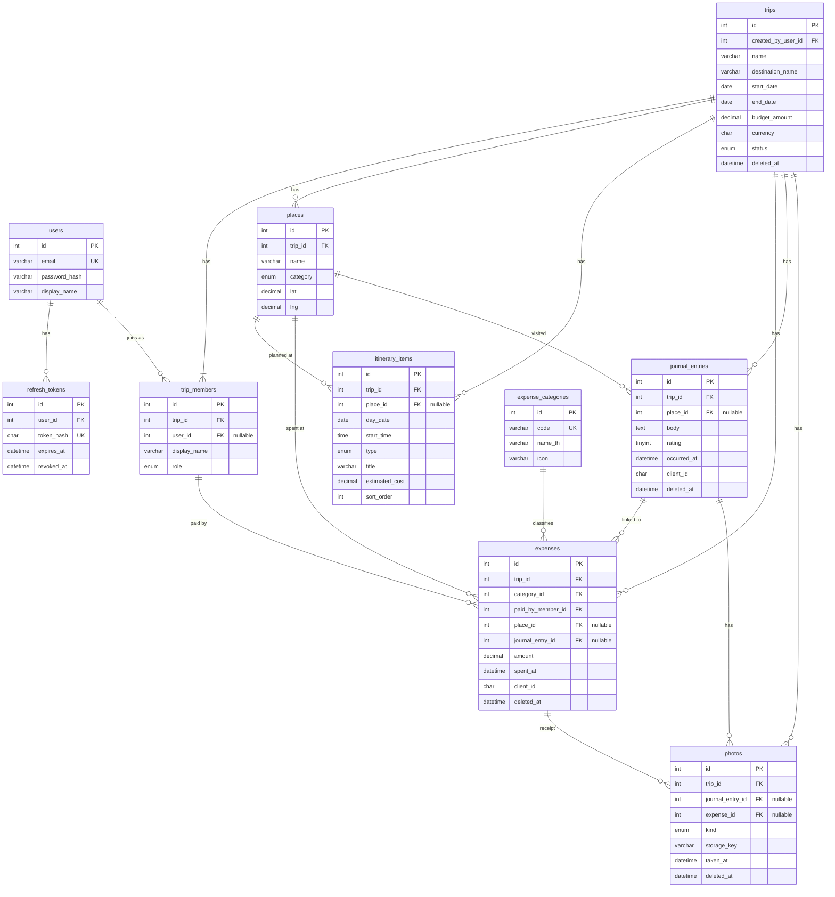

# Database Design

MySQL 8 · InnoDB · `utf8mb4` / `utf8mb4_unicode_ci` · จัดการ schema ด้วย Prisma Migrate

## 1. จาก Domain ที่เสนอมา สู่ตารางจริง

| Entity ที่เสนอ          | ผลการวิเคราะห์                               | ตาราง                |
| ----------------------- | -------------------------------------------- | -------------------- |
| User                    | คงไว้                                        | `users`              |
| —                       | เพิ่ม: รองรับ refresh token rotation         | `refresh_tokens`     |
| Trip                    | คงไว้                                        | `trips`              |
| TripMember              | คงไว้ และ `user_id` เป็น optional            | `trip_members`       |
| Itinerary               | **ตัดออก** วันคำนวณจากช่วงวันของทริป         | —                    |
| ItineraryItem           | คงไว้                                        | `itinerary_items`    |
| Transportation          | **รวม** เป็น itinerary item ชนิด `transport` | —                    |
| Place                   | คงไว้ ผูกกับทริป                             | `places`             |
| Expense                 | คงไว้                                        | `expenses`           |
| ExpenseCategory         | คงไว้ เป็นตารางอ้างอิง                       | `expense_categories` |
| Budget                  | **รวม** เป็น `trips.budget_amount`           | —                    |
| JournalEntry            | คงไว้ รวม "สถานที่ที่ไปจริง" ไว้ด้วย         | `journal_entries`    |
| Photo                   | คงไว้ ใช้ทั้งรูปความทรงจำและใบเสร็จ          | `photos`             |
| TripActivity / Timeline | **ตัดออก** เป็น read model                   | —                    |

รวม **10 ตาราง**

## 2. ERD



## 3. ความสัมพันธ์

| ความสัมพันธ์              | ชนิด                    | หมายเหตุ                                               |
| ------------------------- | ----------------------- | ------------------------------------------------------ |
| User — Trip               | M:N ผ่าน `trip_members` | สิทธิ์อยู่ที่ `trip_members.role`                      |
| Trip — TripMember         | 1:N                     | ทริปต้องมี owner อย่างน้อย 1 คนเสมอ (บังคับใน service) |
| User — TripMember         | 1:N, optional           | member ที่ `user_id` เป็น NULL คือ guest               |
| Trip — Place              | 1:N                     |                                                        |
| Trip — ItineraryItem      | 1:N                     |                                                        |
| Place — ItineraryItem     | 1:N, optional           | item ไม่จำเป็นต้องมีสถานที่                            |
| Trip — Expense            | 1:N                     |                                                        |
| TripMember — Expense      | 1:N                     | คนจ่าย, บังคับมี                                       |
| ExpenseCategory — Expense | 1:N                     | บังคับมี                                               |
| Place — Expense           | 1:N, optional           |                                                        |
| JournalEntry — Expense    | 1:N, optional           | รายจ่ายที่เกิดใน "ช่วงเวลา" นั้น                       |
| Trip — JournalEntry       | 1:N                     |                                                        |
| Place — JournalEntry      | 1:N, optional           | ใช้นับ "สถานที่ที่ไปจริง"                              |
| JournalEntry — Photo      | 1:N, optional           | รูปความทรงจำ                                           |
| Expense — Photo           | 1:N, optional           | รูปใบเสร็จ                                             |

## 4. รายละเอียดตาราง

ทุกตารางใช้ `id INT UNSIGNED AUTO_INCREMENT` เป็น primary key
`created_at` ค่าเริ่มต้นเป็นเวลาปัจจุบัน `updated_at` อัปเดตอัตโนมัติ ทั้งคู่เป็น UTC

### 4.1 `users`

| คอลัมน์                | ชนิด         | Null | หมายเหตุ                     |
| ---------------------- | ------------ | ---- | ---------------------------- |
| id                     | INT UNSIGNED |      | PK                           |
| email                  | VARCHAR(255) |      | **UNIQUE**, เก็บตัวพิมพ์เล็ก |
| password_hash          | VARCHAR(255) |      | bcrypt                       |
| display_name           | VARCHAR(100) |      |                              |
| created_at, updated_at | DATETIME     |      |                              |

ไม่ใช้ soft delete การลบบัญชียังไม่อยู่ใน scope

### 4.2 `refresh_tokens`

| คอลัมน์    | ชนิด         | Null | หมายเหตุ                      |
| ---------- | ------------ | ---- | ----------------------------- |
| id         | INT UNSIGNED |      | PK                            |
| user_id    | INT UNSIGNED |      | FK → users, ON DELETE CASCADE |
| token_hash | CHAR(64)     |      | **UNIQUE**, SHA-256 ของ token |
| expires_at | DATETIME     |      |                               |
| revoked_at | DATETIME     | ✅   | มีค่าเมื่อถูกหมุนหรือ logout  |
| user_agent | VARCHAR(255) | ✅   |                               |
| created_at | DATETIME     |      |                               |

Index: `(user_id)`

### 4.3 `trips`

| คอลัมน์                | ชนิด          | Null | หมายเหตุ                                                          |
| ---------------------- | ------------- | ---- | ----------------------------------------------------------------- |
| id                     | INT UNSIGNED  |      | PK                                                                |
| created_by_user_id     | INT UNSIGNED  |      | FK → users, เพื่อ audit เท่านั้น สิทธิ์ดูจาก `trip_members`       |
| name                   | VARCHAR(150)  |      |                                                                   |
| description            | TEXT          | ✅   |                                                                   |
| origin_name            | VARCHAR(150)  | ✅   |                                                                   |
| destination_name       | VARCHAR(150)  |      |                                                                   |
| destination_lat        | DECIMAL(9,6)  | ✅   |                                                                   |
| destination_lng        | DECIMAL(9,6)  | ✅   |                                                                   |
| start_date             | DATE          |      |                                                                   |
| end_date               | DATE          |      | CHECK `end_date >= start_date`                                    |
| timezone               | VARCHAR(64)   |      | default `Asia/Bangkok`                                            |
| currency               | CHAR(3)       |      | default `THB`                                                     |
| budget_amount          | DECIMAL(12,2) | ✅   | CHECK `>= 0`, NULL = ไม่ตั้งงบ                                    |
| status                 | ENUM          |      | `planning`, `active`, `completed`, `cancelled` default `planning` |
| started_at             | DATETIME      | ✅   | เวลาที่กดเริ่มทริป                                                |
| completed_at           | DATETIME      | ✅   |                                                                   |
| created_at, updated_at | DATETIME      |      |                                                                   |
| deleted_at             | DATETIME      | ✅   | soft delete                                                       |

"จำนวนผู้เดินทาง" ไม่เก็บเป็นคอลัมน์ ใช้จำนวนแถวใน `trip_members` เพื่อไม่ให้มีตัวเลขสองแหล่ง

### 4.4 `trip_members`

| คอลัมน์                | ชนิด         | Null | หมายเหตุ                                     |
| ---------------------- | ------------ | ---- | -------------------------------------------- |
| id                     | INT UNSIGNED |      | PK                                           |
| trip_id                | INT UNSIGNED |      | FK → trips, ON DELETE CASCADE                |
| user_id                | INT UNSIGNED | ✅   | FK → users, NULL = guest                     |
| display_name           | VARCHAR(100) |      | ชื่อที่ใช้แสดงในทริปนี้                      |
| role                   | ENUM         |      | `owner`, `editor`, `viewer` default `editor` |
| created_at, updated_at | DATETIME     |      |                                              |

- **UNIQUE** `(trip_id, user_id)` ผู้ใช้หนึ่งคนเป็นสมาชิกทริปเดียวกันได้ครั้งเดียว
  (MySQL อนุญาตให้ NULL ซ้ำใน unique index จึงมี guest ได้หลายคน)
- Index: `(user_id)` ใช้ดึงรายการทริปของผู้ใช้
- ลบ member ไม่ได้ถ้ามี expense อ้างถึง (FK RESTRICT) service ต้องแจ้งผู้ใช้ให้ชัด

### 4.5 `places`

| คอลัมน์                | ชนิด         | Null | หมายเหตุ                                                                             |
| ---------------------- | ------------ | ---- | ------------------------------------------------------------------------------------ |
| id                     | INT UNSIGNED |      | PK                                                                                   |
| trip_id                | INT UNSIGNED |      | FK → trips, ON DELETE CASCADE                                                        |
| name                   | VARCHAR(150) |      |                                                                                      |
| category               | ENUM         |      | `attraction`, `accommodation`, `food`, `event`, `shopping`, `transport_hub`, `other` |
| address                | VARCHAR(255) | ✅   |                                                                                      |
| lat                    | DECIMAL(9,6) | ✅   |                                                                                      |
| lng                    | DECIMAL(9,6) | ✅   |                                                                                      |
| external_source        | VARCHAR(30)  | ✅   | เตรียมไว้สำหรับ Phase 5                                                              |
| external_id            | VARCHAR(255) | ✅   |                                                                                      |
| note                   | TEXT         | ✅   |                                                                                      |
| created_at, updated_at | DATETIME     |      |                                                                                      |

Index: `(trip_id)`
ที่พักคือ place ที่ `category = accommodation` ไม่มีตารางแยก

### 4.6 `itinerary_items`

| คอลัมน์                | ชนิด          | Null | หมายเหตุ                                                                                                 |
| ---------------------- | ------------- | ---- | -------------------------------------------------------------------------------------------------------- |
| id                     | INT UNSIGNED  |      | PK                                                                                                       |
| trip_id                | INT UNSIGNED  |      | FK → trips, ON DELETE CASCADE                                                                            |
| day_date               | DATE          |      | ต้องอยู่ในช่วงวันของทริป (ตรวจใน service)                                                                |
| start_time             | TIME          | ✅   |                                                                                                          |
| end_time               | TIME          | ✅   |                                                                                                          |
| type                   | ENUM          |      | `activity`, `transport`                                                                                  |
| title                  | VARCHAR(150)  |      |                                                                                                          |
| place_id               | INT UNSIGNED  | ✅   | FK → places, ON DELETE SET NULL                                                                          |
| transport_mode         | ENUM          | ✅   | `bus`, `train`, `car`, `motorcycle`, `taxi`, `flight`, `boat`, `walk`, `other` ใช้เมื่อ type = transport |
| from_label             | VARCHAR(150)  | ✅   | ใช้เมื่อ type = transport                                                                                |
| to_label               | VARCHAR(150)  | ✅   | ใช้เมื่อ type = transport                                                                                |
| estimated_cost         | DECIMAL(12,2) | ✅   | ใช้เทียบแผนกับของจริงใน Phase 6                                                                          |
| note                   | TEXT          | ✅   |                                                                                                          |
| status                 | ENUM          |      | `planned`, `done`, `skipped` default `planned`                                                           |
| sort_order             | INT           |      | ลำดับภายในวัน                                                                                            |
| created_at, updated_at | DATETIME      |      |                                                                                                          |

Index: `(trip_id, day_date, sort_order)`

### 4.7 `expense_categories`

| คอลัมน์    | ชนิด         | Null | หมายเหตุ                                                           |
| ---------- | ------------ | ---- | ------------------------------------------------------------------ |
| id         | INT UNSIGNED |      | PK                                                                 |
| code       | VARCHAR(30)  |      | **UNIQUE** เช่น `food` (ไม่ใช้ชื่อ `key` เพราะเป็นคำสงวนของ MySQL) |
| name_th    | VARCHAR(50)  |      |                                                                    |
| name_en    | VARCHAR(50)  |      |                                                                    |
| icon       | VARCHAR(30)  |      |                                                                    |
| color      | CHAR(7)      |      |                                                                    |
| sort_order | INT          |      |                                                                    |
| is_active  | BOOLEAN      |      | default true                                                       |

ข้อมูลตั้งต้น (seed): `accommodation`, `food`, `transportation`, `fuel`, `tickets`, `shopping`, `activities`, `other`

ทำเป็นตารางแทน enum เพราะต้องมีชื่อแสดงผล ไอคอน สี และเปิดทางให้ผู้ใช้เพิ่มหมวดเองในอนาคต

### 4.8 `expenses`

| คอลัมน์                | ชนิด          | Null | หมายเหตุ                          |
| ---------------------- | ------------- | ---- | --------------------------------- |
| id                     | INT UNSIGNED  |      | PK                                |
| trip_id                | INT UNSIGNED  |      | FK → trips, ON DELETE CASCADE     |
| category_id            | INT UNSIGNED  |      | FK → expense_categories, RESTRICT |
| paid_by_member_id      | INT UNSIGNED  |      | FK → trip_members, RESTRICT       |
| created_by_user_id     | INT UNSIGNED  |      | FK → users, คนที่กดบันทึก         |
| amount                 | DECIMAL(12,2) |      | CHECK `> 0`                       |
| description            | VARCHAR(255)  | ✅   |                                   |
| spent_at               | DATETIME      |      | UTC, default เวลาที่บันทึก        |
| place_id               | INT UNSIGNED  | ✅   | FK → places, SET NULL             |
| journal_entry_id       | INT UNSIGNED  | ✅   | FK → journal_entries, SET NULL    |
| client_id              | CHAR(36)      | ✅   | UUID จาก client                   |
| created_at, updated_at | DATETIME      |      |                                   |
| deleted_at             | DATETIME      | ✅   | soft delete                       |

- **UNIQUE** `(trip_id, client_id)`
- Index: `(trip_id, spent_at)`, `(trip_id, category_id)`, `(trip_id, paid_by_member_id)`
- สกุลเงินใช้ของทริป ไม่มีคอลัมน์ currency รายรายการ
- service ต้องตรวจว่า `paid_by_member_id`, `place_id`, `journal_entry_id` เป็นของทริปเดียวกัน

### 4.9 `journal_entries`

| คอลัมน์                | ชนิด             | Null | หมายเหตุ                                   |
| ---------------------- | ---------------- | ---- | ------------------------------------------ |
| id                     | INT UNSIGNED     |      | PK                                         |
| trip_id                | INT UNSIGNED     |      | FK → trips, ON DELETE CASCADE              |
| created_by_user_id     | INT UNSIGNED     |      | FK → users                                 |
| body                   | TEXT             | ✅   | ข้อความบันทึก                              |
| place_id               | INT UNSIGNED     | ✅   | FK → places, SET NULL                      |
| location_label         | VARCHAR(150)     | ✅   | ชื่อสถานที่แบบพิมพ์เร็ว ไม่ต้องสร้าง place |
| lat                    | DECIMAL(9,6)     | ✅   | ตำแหน่งตอนบันทึก                           |
| lng                    | DECIMAL(9,6)     | ✅   |                                            |
| rating                 | TINYINT UNSIGNED | ✅   | CHECK `BETWEEN 1 AND 5`                    |
| occurred_at            | DATETIME         |      | UTC                                        |
| client_id              | CHAR(36)         | ✅   |                                            |
| created_at, updated_at | DATETIME         |      |                                            |
| deleted_at             | DATETIME         | ✅   | soft delete                                |

- **UNIQUE** `(trip_id, client_id)`
- Index: `(trip_id, occurred_at)`, `(trip_id, place_id)`
- entry สร้างแบบว่างได้ (เพื่อแนบรูปตามหลัง) แต่ timeline จะกรอง entry ที่ไม่มีข้อความ สถานที่ รูป หรือรายจ่ายออก
- **สถานที่ที่ไปจริง** = place ที่มี journal entry อ้างถึง ไม่มีตาราง visit แยก

### 4.10 `photos`

| คอลัมน์             | ชนิด         | Null | หมายเหตุ                       |
| ------------------- | ------------ | ---- | ------------------------------ |
| id                  | INT UNSIGNED |      | PK                             |
| trip_id             | INT UNSIGNED |      | FK → trips, ON DELETE CASCADE  |
| uploaded_by_user_id | INT UNSIGNED |      | FK → users                     |
| kind                | ENUM         |      | `memory`, `receipt`            |
| journal_entry_id    | INT UNSIGNED | ✅   | FK → journal_entries, SET NULL |
| expense_id          | INT UNSIGNED | ✅   | FK → expenses, SET NULL        |
| storage_key         | VARCHAR(255) |      | ไม่ส่งออกทาง API               |
| thumb_key           | VARCHAR(255) |      |                                |
| mime_type           | VARCHAR(50)  |      |                                |
| size_bytes          | INT UNSIGNED |      |                                |
| width, height       | INT UNSIGNED |      |                                |
| caption             | VARCHAR(255) | ✅   |                                |
| taken_at            | DATETIME     | ✅   | จาก EXIF ถ้ามี                 |
| created_at          | DATETIME     |      |                                |
| deleted_at          | DATETIME     | ✅   | soft delete, ไฟล์จริงลบภายหลัง |

- Index: `(trip_id, taken_at)`, `(journal_entry_id)`, `(expense_id)`
- กฎใน service: `kind = receipt` ต้องมี `expense_id`, ห้ามมีทั้ง `journal_entry_id` และ `expense_id` พร้อมกัน

## 5. Soft Delete

| ตาราง           | Soft delete | เหตุผล                                |
| --------------- | ----------- | ------------------------------------- |
| trips           | ✅          | ลบผิดแล้วเสียทั้งทริป ต้องกู้คืนได้   |
| expenses        | ✅          | ข้อมูลเงิน ไม่ควรหายถาวรจากการแตะพลาด |
| journal_entries | ✅          | ความทรงจำ เขียนใหม่ไม่ได้             |
| photos          | ✅          | ต้องแยกขั้นลบไฟล์จริงออกจากการลบแถว   |
| อื่น ๆ          | ❌          | สร้างใหม่ได้ง่าย ไม่คุ้มความซับซ้อน   |

Repository ของตารางที่ใช้ soft delete ต้องใส่ `deleted_at IS NULL` ทุก query ที่อ่าน
เมื่อ soft delete ทริป ข้อมูลลูกไม่ต้องแตะ เพราะเข้าถึงผ่านทริปเท่านั้น

## 6. Query สำคัญ

### รายการทริปของผู้ใช้

```sql
SELECT t.*
FROM trips t
JOIN trip_members m ON m.trip_id = t.id
WHERE m.user_id = ? AND t.deleted_at IS NULL
ORDER BY t.start_date DESC;
```

### สรุปค่าใช้จ่ายตามหมวด

```sql
SELECT c.code, c.name_th, SUM(e.amount) AS total, COUNT(*) AS count
FROM expenses e
JOIN expense_categories c ON c.id = e.category_id
WHERE e.trip_id = ? AND e.deleted_at IS NULL
GROUP BY c.id
ORDER BY total DESC;
```

### ยอดเคลียร์แบบหารเท่า

```sql
SELECT m.id, m.display_name,
       COALESCE(SUM(e.amount), 0) AS paid
FROM trip_members m
LEFT JOIN expenses e
       ON e.paid_by_member_id = m.id AND e.deleted_at IS NULL
WHERE m.trip_id = ?
GROUP BY m.id;
```

จากนั้น service คำนวณ `share = total / จำนวนสมาชิก` และ `balance = paid − share`
ค่าบวกคือควรได้คืน ค่าลบคือต้องจ่ายเพิ่ม เศษสตางค์จากการหารให้ลงที่สมาชิกคนแรกเพื่อให้ผลรวมเป็นศูนย์

## 7. ส่วนขยายในอนาคต

ไม่สร้างตอนนี้ แต่โครงสร้างปัจจุบันรองรับโดยไม่ต้องรื้อ

| ความต้องการ            | สิ่งที่จะเพิ่ม                                                                                                         |
| ---------------------- | ---------------------------------------------------------------------------------------------------------------------- |
| หารไม่เท่ากันรายรายการ | ตาราง `expense_shares (expense_id, member_id, amount)`                                                                 |
| งบแยกตามหมวด           | ตาราง `trip_category_budgets (trip_id, category_id, amount)`                                                           |
| หมวดที่ผู้ใช้สร้างเอง  | คอลัมน์ `trip_id` nullable ใน `expense_categories`                                                                     |
| เชิญเพื่อนเข้าทริป     | ตาราง `trip_invites (trip_id, member_id, token_hash, expires_at)` เมื่อรับคำเชิญจะเติม `user_id` ให้ guest member เดิม |
| หลายสกุลเงิน           | คอลัมน์ `currency`, `exchange_rate` ใน `expenses`                                                                      |
| รูปปกทริป              | คอลัมน์ `cover_photo_id` ใน `trips`                                                                                    |

## 8. กติกา Migration

- ทุกการเปลี่ยน schema ทำผ่าน `prisma migrate dev` พร้อมชื่อที่สื่อความหมาย
- ห้ามแก้ migration ที่ commit แล้ว
- CHECK constraint ที่ Prisma schema ประกาศไม่ได้ ให้เพิ่มด้วย SQL ในไฟล์ migration (ชุดแรกอยู่ที่ `server/prisma/check-constraints.sql`)
- Production ใช้ `prisma migrate deploy` เท่านั้น
- Seed แบ่งสองส่วน: ข้อมูลอ้างอิง (หมวดค่าใช้จ่าย รันได้ทุก environment) และข้อมูลตัวอย่าง (ทริปนำร่อง รันเฉพาะ dev)
- เมื่อ schema เปลี่ยน ต้องอัปเดตเอกสารนี้ใน commit เดียวกัน
